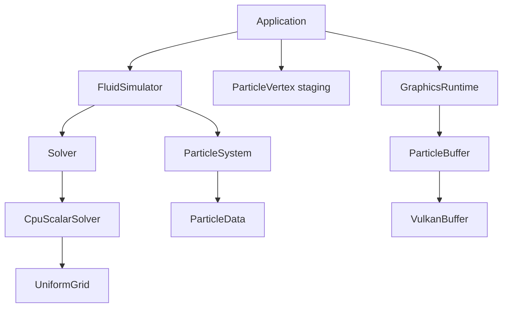

# Fluid Simulator

Fluid Simulator is an early-stage 3D particle fluid simulator written in
C++20. The current application runs an SPH simulation on a scalar,
OpenMP-parallel CPU backend and renders the particles as Vulkan point sprites
in a GLFW window.

> **Project status:** the CPU simulation and Vulkan rendering path are
> functional, but the application is still experimental. CUDA is a planned
> backend; there is no CUDA implementation in the repository today.

## Demo

https://github.com/user-attachments/assets/5d53c393-3607-4f4b-9a94-7fd8b020c329

## Current features

- Smoothed Particle Hydrodynamics (SPH) with density/pressure, force, and
  integration passes.
- Structure-of-Arrays (SoA) storage for particle positions, velocities,
  densities, and pressures.
- A flat Uniform Grid that restricts neighbor queries to the 27 cells around a
  particle.
- OpenMP parallelization of the three particle passes in the CPU solver.
- Axis-aligned box collision handling.
- Vulkan rendering with a depth buffer, two frames in flight, synchronized
  per-frame particle buffers, and swapchain recreation on resize.
- GLSL vertex and fragment shaders compiled to SPIR-V by CMake.
- A smoke-test mode that exercises rendering, window resize, swapchain
  recreation, and clean shutdown.

The application currently initializes 2,000 particles. Storage and rendering
buffers are preallocated for up to 100,000 particles.

## Build

### Prerequisites

- CMake 3.24 or newer
- A C++20 compiler
- Vulkan headers and loader
- A Vulkan-capable driver and device with swapchain and `largePoints` support
- GLFW 3.3 or newer
- GLM with a CMake package configuration
- OpenMP support for the selected compiler
- `glslc`, supplied by the Vulkan SDK or a Shaderc package

CMake must be able to locate Vulkan, GLFW, GLM, and OpenMP through
`find_package`. If `glslc` is not on `PATH`, set `VULKAN_SDK` so CMake can find
it in `$VULKAN_SDK/bin`.

The repository does not define a CI or platform support matrix. The code uses
portable CMake, GLFW, and Vulkan APIs; the commands below assume a Unix-like
desktop environment with working Vulkan surface support.

### Release build

```sh
cmake -S . -B build -DCMAKE_BUILD_TYPE=Release
cmake --build build -j
```

The build creates `build/fluid-simulator`. CMake also compiles
`shaders/particle.vert` and `shaders/particle.frag` into
`build/shaders/*.spv`; no separate shader command is required.

### Debug build

```sh
cmake -S . -B build-debug -DCMAKE_BUILD_TYPE=Debug
cmake --build build-debug -j
```

Debug builds request the `VK_LAYER_KHRONOS_validation` layer and Vulkan debug
utilities. If either is unavailable, the application prints a warning and
continues without validation.

## Run

```sh
./build/fluid-simulator
```

The window can be resized or closed through the window manager. There are no
keyboard, mouse, or runtime simulation controls yet; the camera and simulation
parameters are currently fixed in code.

For an automated graphical smoke test:

```sh
./build/fluid-simulator --smoke-test
```

This mode resizes the window after 30 rendered frames and closes it after 90.
It still requires a working display, Vulkan loader, driver, and presentation
surface; it is not a headless unit test.

## Architecture



`Application` is the top-level owner of the simulation and rendering systems. It contains the `FluidSimulator`, the intermediate `ParticleVertex` staging storage, and the `GraphicsRuntime`.

`FluidSimulator` owns both the `ParticleSystem` and the active `Solver`. The particle system owns the simulation data in a Structure of Arrays (`ParticleData`) layout, while simulation steps are delegated through the abstract `Solver` interface. The current CPU implementation, `CpuScalarSolver`, operates on this particle data and owns a `UniformGrid` used to accelerate SPH neighbor searches.   

After each simulation update, active particle positions are converted into `ParticleVertex` data by the application and passed to `GraphicsRuntime`. The rendering runtime owns a `ParticleBuffer`, which manages the Vulkan buffers used to store particle vertices for rendering. 

See [Architecture](docs/architecture.md) for the Vulkan runtime and resource flow, and [Simulation](docs/simulation.md) for the SPH pipeline, SoA particle layout, Uniform Grid, simulation parameters, and OpenMP execution model.

## Repository layout

```text
include/app/                 Application interface
include/backends/cpu/        Scalar CPU solver interface
include/core/                Camera and frame timer
include/graphics/vulkan/     Vulkan renderer interfaces
include/simulation/          Backend-independent simulation types
src/                         Implementations matching the include tree
shaders/                     GLSL particle shaders
docs/                        Architecture and simulation documentation
CMakeLists.txt               Build and shader compilation configuration
```

## Development

CMake exports `build/compile_commands.json` automatically. The checked-in
VS Code settings point clangd at `build`, and `.clang-format` defines the C/C++
formatting style.

Format a changed file with:

```sh
clang-format -i path/to/file.cpp
```

GNU and Clang builds enable `-Wall`, `-Wextra`, `-Wpedantic`, `-Wshadow`, and
`-Wconversion`. The repository currently has no checked-in Clang-Tidy
configuration, test target, or benchmark suite.

## Current limitations

- The scalar CPU backend is the only simulation backend.
- Particle count, initial distribution, container size, camera, and SPH
  parameters are hard-coded.
- The simulation performs one step per rendered frame and caps that step at
  1 ms; it has no fixed-step accumulator or substepping controller.
- The renderer displays fixed-size, single-color point sprites rather than a
  reconstructed fluid surface.
- Particle positions are repacked and copied from CPU simulation storage to a
  host-visible Vulkan vertex buffer every frame.
- There are no interactive controls, automated numerical tests, or recorded
  benchmark results.

## Roadmap

The planned direction is to add a CUDA solver backend while preserving the
existing solver boundary, followed by Vulkan/CUDA interoperability to reduce
or remove per-frame host copies. These features are not implemented yet.
