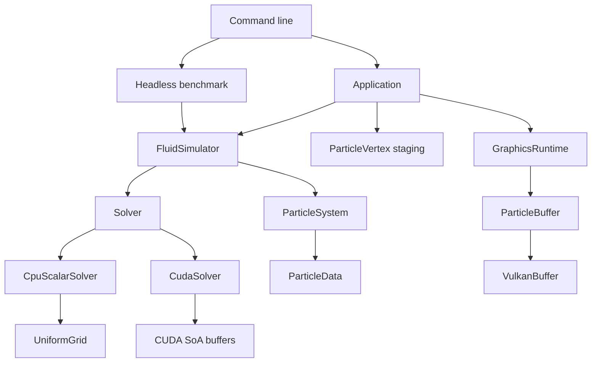

# Fluid Simulator

Fluid Simulator is an early-stage 3D particle fluid simulator written in
C++20 and CUDA. The current application runs an SPH simulation with a naive
CUDA backend and renders the particles as Vulkan point sprites in a GLFW
window. An OpenMP-parallel CPU backend is also implemented.

> **Project status:** the CPU and CUDA simulation backends and Vulkan rendering
> path are functional, but the application is still experimental. The CUDA
> backend is a correctness baseline and is not yet optimized. Direct
> Vulkan/CUDA interoperability is not implemented.

## Demo

https://github.com/user-attachments/assets/5d53c393-3607-4f4b-9a94-7fd8b020c329

## Current features

- Smoothed Particle Hydrodynamics (SPH) with density/pressure, force, and
  integration passes.
- Structure-of-Arrays (SoA) storage for particle positions and velocities.
- A scalar CPU backend with OpenMP parallelization and a flat Uniform Grid that
  restricts neighbor queries to the 27 cells around a particle.
- A naive CUDA backend with separate density/pressure, acceleration, and
  integration/collision kernels.
- Persistent CUDA allocations using the same SoA fields as the CPU data, with
  explicit `cudaMemcpy` transfers around each simulation step.
- Axis-aligned box collision handling.
- Vulkan rendering with a depth buffer, two frames in flight, synchronized
  per-frame particle buffers, and swapchain recreation on resize.
- GLSL vertex and fragment shaders compiled to SPIR-V by CMake.
- Runtime selection between the CPU and CUDA simulation backends.
- A headless benchmark mode that measures the real simulation update path.
- A smoke-test mode that exercises rendering, window resize, swapchain
  recreation, and clean shutdown.

The application currently initializes 20,000 particles. Storage and rendering
buffers are preallocated for up to 100,000 particles.

## Build

### Prerequisites

- CMake 3.24 or newer
- A C++20 compiler
- Vulkan headers and loader
- A Vulkan-capable driver and device with swapchain and `largePoints` support
- GLFW 3.3 or newer
- GLM with a CMake package configuration
- OpenMP support for the selected compiler
- CUDA Toolkit with `nvcc`
- A CUDA-capable NVIDIA GPU with a compatible driver
- `glslc`, supplied by the Vulkan SDK or a Shaderc package

CMake must be able to locate Vulkan, GLFW, GLM, and OpenMP through
`find_package`. The project enables both C++ and CUDA languages, so the CUDA
Toolkit and `nvcc` must also be discoverable during configuration. If `glslc`
is not on `PATH`, set `VULKAN_SDK` so CMake can find it in `$VULKAN_SDK/bin`.
CUDA is currently enabled unconditionally; there is no CPU-only CMake option.

The repository does not define a CI or platform support matrix. The code uses
CMake, GLFW, Vulkan, OpenMP, and CUDA; the commands below assume a Unix-like
desktop environment with working Vulkan surface support and an NVIDIA CUDA
toolchain and device.

### Release build

```sh
cmake -S . -B build -DCMAKE_BUILD_TYPE=Release
cmake --build build -j
```

The build creates `build/fluid-simulator`. CMake also compiles
`shaders/particle.vert` and `shaders/particle.frag` into
`build/shaders/*.spv`; no separate shader command is required.

### Debug build

```sh
cmake -S . -B build-debug -DCMAKE_BUILD_TYPE=Debug
cmake --build build-debug -j
```

Debug builds request the `VK_LAYER_KHRONOS_validation` layer and Vulkan debug
utilities. If either is unavailable, the application prints a warning and
continues without validation.

## Run

```sh
./build/fluid-simulator
./build/fluid-simulator --backend cpu
./build/fluid-simulator --backend cuda
```

CUDA is the default backend. The window can be resized or closed through the
window manager. There are no keyboard, mouse, or runtime parameter controls
yet; initialization defaults are defined by the C++ configuration structs.

Use `-h` or `--help` to list the supported command-line options:

```sh
./build/fluid-simulator --help
```

### Headless benchmark

```sh
./build/fluid-simulator --benchmark
./build/fluid-simulator --benchmark --backend cpu
./build/fluid-simulator --benchmark --backend cuda
```

Benchmark mode bypasses the application, GLFW, and Vulkan. It initializes the
same particle system and selected simulation backend as GUI mode, runs 100
warmup steps followed by 1,000 measured steps, and measures the complete
simulation update path. CUDA results therefore include the current host/device
copies and synchronization. The output reports total time, average time per
step, steps per second, and particles processed per second. CUDA remains the
default backend when `--backend` is omitted.

For an automated graphical smoke test:

```sh
./build/fluid-simulator --smoke-test
```

This mode resizes the window after 30 rendered frames and closes it after 90.
It still requires a working display, Vulkan loader, driver, and presentation
surface; it is not a headless unit test.

## Architecture


```mermaid
flowchart TB
    CLI[Command line] --> A[Application]
    CLI --> N[Headless benchmark]
    A --> B[FluidSimulator]
    N --> B
    A --> H[ParticleVertex staging]
    A --> I[GraphicsRuntime]

    B --> C[Solver]
    C --> D[CpuScalarSolver]
    D --> E[UniformGrid]
    C --> L[CudaSolver]
    L --> M[CUDA SoA buffers]

    B --> F[ParticleSystem]
    F --> G[ParticleData]

    I --> J[ParticleBuffer]
    J --> K[VulkanBuffer]
```

`Application` is the top-level owner of the simulation and rendering systems.
It contains the `FluidSimulator`, the intermediate `ParticleVertex` staging
storage, and the `GraphicsRuntime`.

`FluidSimulator` owns both the `ParticleSystem` and the active `Solver`. The
particle system owns the simulation data in a Structure of Arrays
(`ParticleData`) layout, while simulation steps are delegated through the
abstract `Solver` interface. Both `CpuScalarSolver` and `CudaSolver` implement
this interface. `SimulationConfig` selects the backend for both GUI and
benchmark modes; CUDA is the default and `--backend cpu` selects the CPU
implementation. The CPU implementation owns a `UniformGrid`, while the initial
CUDA implementation performs an all-pairs neighbor search.

After each CUDA simulation update, particle data is copied back to the host.
Active positions are then converted into `ParticleVertex` data by the
application and passed to `GraphicsRuntime`. The rendering runtime owns a
`ParticleBuffer`, which manages the Vulkan buffers used to store particle
vertices for rendering. CUDA and Vulkan do not share memory directly.

See [Architecture](docs/architecture.md) for the Vulkan runtime and resource
flow, and [Simulation](docs/simulation.md) for the SPH pipeline, SoA particle
layout, Uniform Grid, simulation parameters, and CPU/CUDA execution models.

## Repository layout

```text
include/app/                 Application interface
include/benchmark/           Headless benchmark interface
include/backends/cpu/        Scalar CPU solver interface
include/backends/cuda/       Naive CUDA solver interface
include/core/                Camera and frame timer
include/graphics/vulkan/     Vulkan renderer interfaces
include/simulation/          Backend-independent simulation types
include/config.hpp           Application and simulation configuration defaults
src/                         Implementations matching the include tree
shaders/                     GLSL particle shaders
docs/                        Architecture and simulation documentation
CMakeLists.txt               Build and shader compilation configuration
```

## Development

CMake exports `build/compile_commands.json` automatically. The checked-in
VS Code settings point clangd at `build`, and `.clang-format` defines the C/C++
formatting style.

Format a changed file with:

```sh
clang-format -i path/to/file.cpp
```

GNU and Clang builds enable `-Wall`, `-Wextra`, `-Wpedantic`, `-Wshadow`, and
`-Wconversion`. The repository currently has no test target. Its benchmark is
a runtime mode of the main executable rather than a separate target or suite.

## Current limitations

- The backend is selected at startup; there is no live backend switching.
- The CUDA density and acceleration kernels use naive all-pairs neighbor
  searches with O(n²) work.
- CUDA uses synchronous `cudaMemcpy` transfers from host to device and back on
  every simulation step.
- Vulkan/CUDA external-memory interoperability is not implemented.
- Main initialization values are centralized in C++ configuration structs, but
  there is no external configuration file or CLI tuning beyond backend
  selection.
- The simulation performs one step per rendered frame and caps that step at
  1 ms; it has no fixed-step accumulator or substepping controller.
- The renderer displays fixed-size, single-color point sprites rather than a
  reconstructed fluid surface.
- Particle positions are copied back from CUDA, repacked on the CPU, and then
  copied into a host-visible Vulkan vertex buffer every frame.
- There are no interactive controls, automated numerical tests, or published
  benchmark results.

## Roadmap

The CUDA backend is intended as a baseline for further work:

- add a GPU spatial grid and accelerated neighbor search;
- improve memory access and investigate shared-memory reuse;
- profile and optimize kernel execution;
- reduce CPU/GPU transfers;
- add Vulkan/CUDA external-memory interoperability.

These optimizations and interoperability features are not implemented yet.
